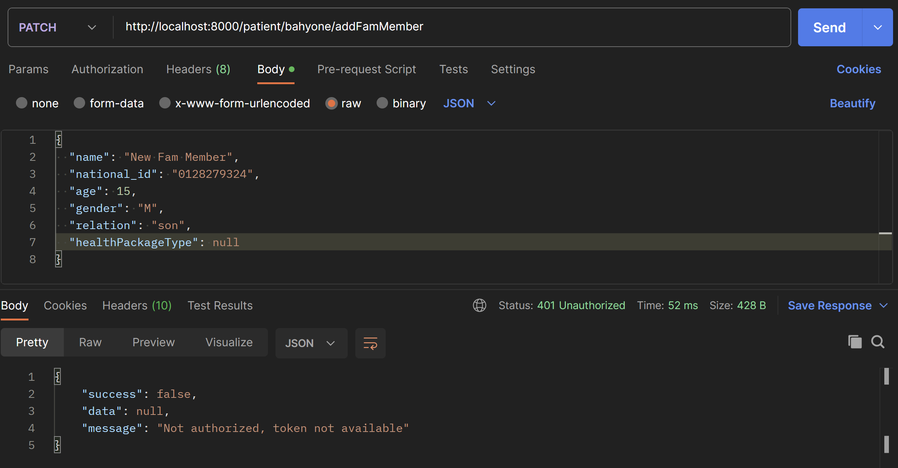

# El7a2ni Clinic: A virtual online clinic

El7a2ni clinic is a virtual online clinic platform that enables patients and doctors to communicate and streamline the usually tedious process of booking visits and recieving prescriptions in the usual ohysical setting of traditional clinics.

---

# Section 1: Brief

## 1.1 | Motiviation:

This project was motivated by the very dire need for a more accessible and streamlined way of communication between doctors and patients unlike what is usually present in the real world. Most traditional clinics are usually limited by how many patients they can take in a day and how many of the staff is able to work on any given day. Most tasks have the ability to be automated and streamlined using software solutions that will subsequently increase the capacity of doctors to receive more patients and the ability of patients to communicate with more doctors effeciently; All while keeping their prescriptions and visit statuses organized and accessible any time without the need to call in and ask a staff member.

## 1.2 | Build Status:

Currently the system is working as expected, all functionalities including the more sophisticated ones like video calling, live chatting, booking visits and downloading prescriptions are running with no known issues. Currently if any user is using a _**Chromium based**_ web browser; they will need to run a custom command through termninal on their machine:

| Windows                                                                                                   | MacOS                                                                                                                              |
| --------------------------------------------------------------------------------------------------------- | ---------------------------------------------------------------------------------------------------------------------------------- |
|  |              |
| `chrome.exe --disable-web-security --user-data-dir="C:\temp"`                                             | `open -n -a /Applications/Google\ Chrome.app/Contents/MacOS/Google\ Chrome --args --user-data-dir="<path>" --disable-web-security` |
| **Win+R**                                                                                                 | From Terminal                                                                                                                      |

## 1.3 | Code Style:

The code style is enforced using eslint and prettier, both are plugins installed in VS-Code to manage the overall code cleanliness and follow usual conventions in web development.

Prettier link: [Prettier](https://marketplace.visualstudio.com/items?itemName=esbenp.prettier-vscode).

Eslint link: [Eslint](https://marketplace.visualstudio.com/items?itemName=dbaeumer.vscode-eslint).

## 1.4 | Tech and frameworks:

|                                                      |                                                                                                                      |
| ---------------------------------------------------- | -------------------------------------------------------------------------------------------------------------------- |
| [React](https://reactjs.org/)                        |                   |
| [Node.js](https://nodejs.org/en/)                    |               |
| [JWT](https://jwt.io/)                               |                           |
| [Express](https://expressjs.com/)                    |            |
| [MongoDB](https://www.mongodb.com/)                  |       |
| [Mongoose](https://mongoosejs.com/)                  |       |
| [Material-UI](https://material-ui.com/)              |                   |
| [Stripe](https://stripe.com/)                        |                 |
| [Git](https://git-scm.com/)                          |                   |
| [Github Actions](github.com/features/actions)        |          |
| [MongoDB Atlas](https://www.mongodb.com/cloud/atlas) |   |
| [Postman](https://www.postman.com/)                  |          |
| [VSCode](https://code.visualstudio.com/)             |  |
| [JavaScript](https://www.javascript.com/)            |         |

---

# Section 2: Features

## 2.1 | Main features:

#### El7a2ni's clinic offers a wide range of features that you might need in a traditional clinic and more, these include:

> ⚠️: **Note:** Click to expand.

<details>
    
 <summary> As a Patient, you can: </summary>
 
  - Reserve and book slots for visits or checkups.
  - Start a video conference with a doctor.
  - Upload and download prescriptions and medical health history documents.
  - Subscribeto health packages for yourself or family members.
  - Get a virtual wallet for payments.
  - Live text chat with a doctor.
  - Link other accounts as family members and relatives.
  - Save credit cards for future payments.
  - Find any doctors in any fields.
  - Claim refunds on eligible items.
    
</details>

<details>
 <summary> As a Doctor, you can: </summary>
 
  - Checkout and update reserved slots on your schedule.
  - Input your hourly rate and get verified on the system.
  - Add custom available time slots for reservations.
  - Upload prescriptions for individual patients.
  - Reschedule and cancel appointments.
  - Update patient's health records.
  - Accept or revoke any follow up requests from any patient.
  - Search for a patient or a group of patients by name.
  - Start a video confrence with individual patients.
    
</details>

<details>
    
 <summary> As an Admin, you can: </summary>
 
  - Add other system adminstrators.
  - Remove users from the system (Doctors/Patients/Admins).
  - Accept or reject doctor applications.
  - Add, update or delete healthpackages and prices.
</details>

## 2.2 | Code examples and screenshots:

---

# Section 3: How to use

## 3.1 | APIs:

> ⚠️: **Note:** Click to expand.

<details>
    <summary>
        Patient Routes (/patient)
    </summary>

`router.get("/")` Fetches all patients

`router.post("/")` Creates a patient

`router.post("/:username/healthrecords")` Allows a patient to upload his/her health records

`router.delete("/:username/healthrecords/:recordId")` Allows patient to delete a health records

`router.get("/:username/healthrecords")` Fetches all health records of a patient

`router.get("/freeAppointments")` Fetches all free appointments a patient can reserve

`router.get("/:username")` Gets all the data related to a patient with a specific username

`router.post("/:username/bookAppointment")` Allows patient to book an appointment

`router.post("/:username/reschduleAppointment")` Allos patient to reschedule an appointment

`router.delete("/:username/appointments/:doctor_id:appointment_id")` Allows patient to cancel an appointment

`router.post("/:username/requestFollowUp")` Allows patient to request a followUp to an appointment

`router.patch("/:username/addFamMember")` Allows patient to add a family member to their account

`router.patch("/:username/linkFamMember")` Allows patient to link their account to another family member's account on our service

`router.get("/:username/prescriptions")` Fetches all prescriptions of a patient

`router.post("/:username/subscriptions/subscribe")` Allows patient to subscribe to a health package for themselves and family members

`router.patch("/:username/subscriptions/cancel")` Allows patient to cancel a health package subscription

`router.get("/getAllUnseenNotifications/:username")` Fetches all unseen notifications for a certain patient

`router.patch("/markNotificationAsSeen/:username/)` Marks seen notifications

</details>

<details>
    <summary>
      Admin Routes (/admin)
    </summary>

`router.post("/getAdmin/:username")` Gets an admin with a specified username

`router.get("/viewAdmins")` Views all admins

`router.post("/createAdmin")` Creates an admin and adds it to the DB
`router.delete("/removeAdmin/:username")` Removes the admin with the specified username from the DB

`router.get("/viewDoctors")` Allows an admin to view all registered doctors on a system

`router.delete("/removeDoctor/:username")` Allows an admin to remove a doctor with the specified username from the system

`router.get("/viewPatients")` Allows an admin to view all registered patients on the system

`router.delete("/removePatient/:username")` Allows an admin to remove a patient with the specified username from the system

`router.get("/viewInfo")` Allows admin to view all pending doctor applications.

`router.post("/acceptDoctor", acceptDoctor)` and `router.post("/rejectDoctor")` allow an admin to accept or request a doctor's application on the system.

`router.get("/viewPackages")`
`router.post("/addPackage")`
`router.patch("/updatePackage/:packageType")`
`router.delete("/deletePackage/:packageType")` allow an admin to create, update, view and delete a health package from the system

</details>

<details>
    <summary>
      Doctor Routes (/doctor)
    </summary>

`router.get("/:username")` Fetches the doctor with the specified username

`router.post("/create")` Creates a doctor and adds it to the DB

`router.put("/update/:username")` Updates a doctor

`router.get("/appointments/:username")` Gets all appointments of a doctor

`router.post("/createAppointments")` Creates an appointments that can be later reserved

`router.get("/acceptContract/:username")` Allows doctor with a specific username to accept a contract

`router.post("/schedule/:username")` Gets the schedule of a Doctor

`router.get("/contract/getMarkup/:username")` Gets the markup of a contract for a doctor with a specified

`router.post("/cancelAppointment/:username")` Allows a doctor to cancel an appointment

`router.post("/addToPrescription/")` `router.post("/removeFromPrescription/")` Allow doctor to add/remove medicines to a prescription

`router.post("/acceptAppointment/:username")`
`router.post("/revokeAppointment")` allow a doctor to accept or revoke appointments

`router.get("/getPrescriptions/:username")` fetches prescriptions

`router.get("/chat/getPatients/:username")` For a doctor with the specified username, this route fetches all patients this doctor can chat with

`router.post("/saveAdditionalMedicines")` Allows doctor to add additional medicines to a prescription

`router.get("/getAllUnseenNotifications/:username")` Fetches all unseen notifications for a certain patient

`router.patch("/markNotificationAsSeen/:username/)` Marks seen notifications

</details>

<details>
    <summary>
      Doctor Requests routes (/doctorRequest)
    </summary>

`router.get("/")` gets all doctor requests

`router.post("/")` submit a request to join the platform as a doctor

`router.patch("/updateInfo/:username")` Allows to update application info for a doctor who wants to join the platform

</details>

<details>
    <summary>
      Account Router (/account)
    </summary>

`router.post("/registerPatient")` Registers a new patinent to the platorm

`router.post("/registerDoctor")` Registers a new doctor to the platform

`router.post("/login")` Allows for the login functionality

`router.get("/logout")` allows for the logout functionality

`router.post("/forgotPassword")` `router.post("/resetPassword")`allows an account to reset their password in case they forgot it

`router.post("/verifyOTP")` Allows for OTP verification

</details>

## 3.2 | Testing:

We used Postman to test our different API endpoints.

> ⚠️: **Note:** Use any rout with the appropreiate request to test them, an example is provided below.



| Element         | Input                                                                                                                                    |
| --------------- | ---------------------------------------------------------------------------------------------------------------------------------------- |
| Test API:       | `http://localhost:8000/patient/bahyone/addFamMember`                                                                                     |
| Test Body JSON: | `{"name" : "New Fam Member","national_id" : "0123456789","age" : "15", "gender" : "M", "relation" : "son", "healthPackageType" : null }` |

### Expected reply JSON:

```bash
{
    "success" : false,
    "data" : null,
    "message" : "Not authorized, token not available"

}
```

## 3.3 | How to use:

To run backend

```bash
cd backend && npm run dev
```

To run frontend

```bash
cd frontend && npm start
```

the backend server and client will be running on the specified ports on your env files.

### Environment Variables

To run this project, you will need to add the following environment variables to your .env file

<details>
    <summary>
        envs
    </summary>

`DATABASE_URL`

`PORT`

`VIDEO_PORT`

`SOCKET_PORT`

</details>

## 3.3 | Contribution:

There are a lot more features and improvements that could be made to this project, this is why we welcome contributions with open arms!

Please adhere to this project's code of conduct.

### Getting Started

1. Fork the repository
2. Clone the repository
3. Install dependencies
4. Create a new branch
5. Make your changes
6. Commit and push your changes
7. Create a pull request
8. Wait for your pull request to be reviewed and merged

### Code of Conduct

This project follows the [Contributor Covenant Code of Conduct](https://www.contributor-covenant.org/version/2/0/code_of_conduct/). Please read the [full text](https://www.contributor-covenant.org/version/2/0/code_of_conduct/) so that you can understand what actions will and will not be tolerated.

---

# Section 4: Credits and Licensing

## Credits:


## License:

**MIT License**

*Copyright (c) 2023 Skill-IssueSquad*

Permission is hereby granted, free of charge, to any person obtaining a copy
of this software and associated documentation files (the "Software"), to deal
in the Software without restriction, including without limitation the rights
to use, copy, modify, merge, publish, distribute, sublicense, and/or sell
copies of the Software, and to permit persons to whom the Software is
furnished to do so, subject to the following conditions:

The above copyright notice and this permission notice shall be included in all
copies or substantial portions of the Software.

THE SOFTWARE IS PROVIDED "AS IS", WITHOUT WARRANTY OF ANY KIND, EXPRESS OR
IMPLIED, INCLUDING BUT NOT LIMITED TO THE WARRANTIES OF MERCHANTABILITY,
FITNESS FOR A PARTICULAR PURPOSE AND NONINFRINGEMENT. IN NO EVENT SHALL THE
AUTHORS OR COPYRIGHT HOLDERS BE LIABLE FOR ANY CLAIM, DAMAGES OR OTHER
LIABILITY, WHETHER IN AN ACTION OF CONTRACT, TORT OR OTHERWISE, ARISING FROM,
OUT OF OR IN CONNECTION WITH THE SOFTWARE OR THE USE OR OTHER DEALINGS IN THE
SOFTWARE.

